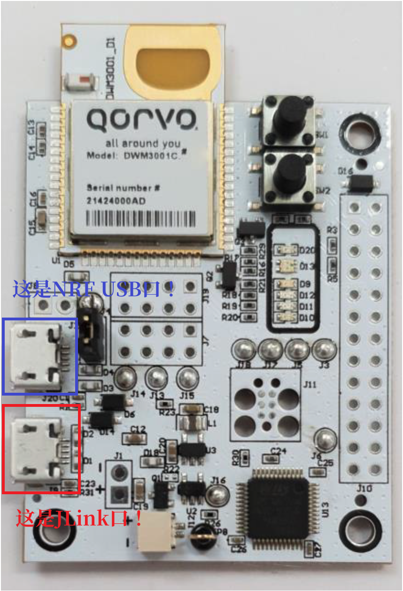
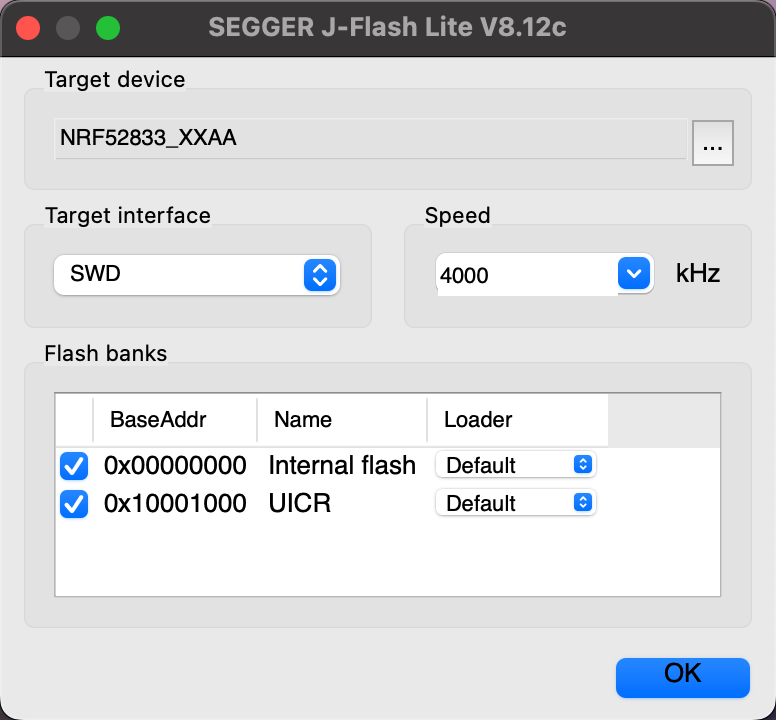
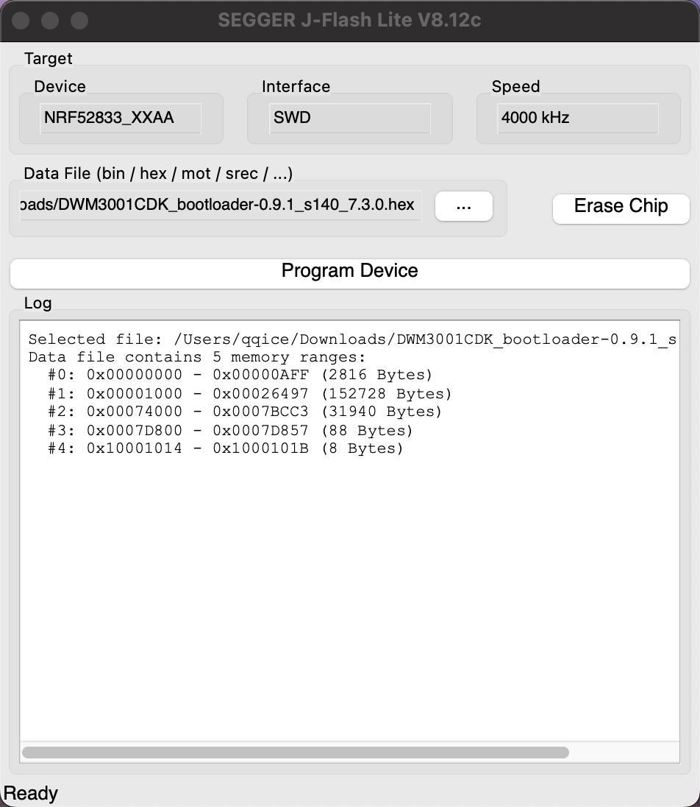
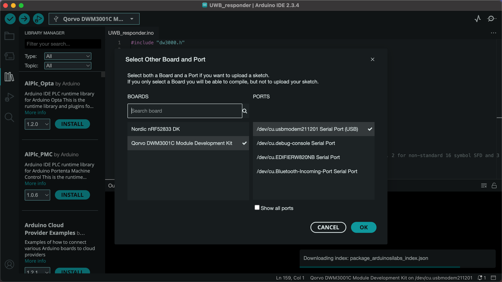

# DWM3001CDK适配进度

## 可用的SDK：

1.[qqice/Adafruit_nRF52_Arduino](https://github.com/qqice/Adafruit_nRF52_Arduino)

### 优点：

* 社区维护活跃

* 支持BLE

* （理论上）支持NFC

* 支持从NRF52833的USB口通过DFU烧入程序

### 缺点：

* 需要额外刷入单独的bootloader

* 编写代码时**需要打开串口**，否则将无法从NRF52833的USB口烧入程序（如果您遇到了这个问题，可以清空flash后再次刷入一次bootloader即可恢复）

2.[qqice/arduino-nRF5](https://github.com/qqice/arduino-nRF5)

### 优点：

* 无需刷入bootloader，开箱即用

* 理论上支持BLE，但需要额外刷入SoftDevice

### 缺点：

* 暂不支持从NRF52833的USB口通过DFU烧入程序

* 暂不支持NRF52833的USB串口功能，需要外接USB转TTL工具读取串口

## 功能支持

| 功能 |   Adafruit_nRF52_Arduino支持状态   |     arduino-nRF5支持状态     |     代码示例      |
| :--: | :--------------------------------: | :--------------------------: | :---------------: |
| GPIO |                 ✅                  |              ✅               |     RGB_Blink     |
| UART |                 ✅                  |              ✅               | SerialPassthrough |
| I2C  |                 ✅                  |              ✅               | IMU_BasicReadings |
| SPI  |    ✅（使用外接SPI屏幕测试成功）    | ✅（使用外接SPI屏幕测试成功） |       暂无        |
| BLE  |    ✅（需使用adafruit版本的SDK）    |              ❓               |  任意一个BLE示例  |
| NFC  | ❓（手头没有NFC天线，暂时测不起来） |              ❓               |                   |

## 外设支持

|    外设    | 协议 | 状态 |                              库                              |     代码示例      |
| :--------: | :--: | :--: | :----------------------------------------------------------: | :---------------: |
| LIS2DH12TR | I2C  |  ✅   | [SparkFun_LIS2DH12_Arduino_Library](https://github.com/sparkfun/SparkFun_LIS2DH12_Arduino_Library) | IMU_BasicReadings |
|   DW3110   | SPI  |  ✅   | [qqice/UWB-DW3000-NRF52](https://github.com/qqice/UWB-DW3000-NRF52) |  见仓库examples   |

# 使用教程

## 电脑端准备工作：

### 1. 安装Arduino IDE

### 2. 安装Adafruit_nRF52_Arduino或arduino-nRF5
安装流程为：
2.1. 打开Arduino IDE
2.2. 从开发板管理器中安装官方的Adafruit_nRF52_Arduino或arduino-nRF5
2.3. 从我的github仓库中下载修改后的Adafruit_nRF52_Arduino或arduino-nRF5
2.4. 将下载的文件解压覆盖到Arduino的**对应**文件夹中
2.5. 重启Arduino IDE

### 3. 安装额外的外设库
安装流程为：
3.1. 打开Arduino IDE
3.2. 去上文提及支持的外设库的github仓库中下载zip文件
3.3. 在如图所示的地方添加zip文件

3.4. 重启Arduino IDE

### 4.安装JFlashLite，用于烧录bootloader

## 开发板端准备工作：

### 1. 烧录bootloader（仅Adafruit_nRF52_Arduino需要）
烧录流程为：
1.1. 将DWM3001CDK的**JLink口**连接到电脑（如图所示）

1.2. 打开JFlashLite
1.3. 选择**NRF52833_XXAA**，点击**OK**

1.4. 下载[bootloader](https://github.com/qqice/Adafruit_nRF52_Arduino/raw/refs/heads/master/bootloader/DWM3001CDK/DWM3001CDK_bootloader-0.9.1_s140_7.3.0.hex)
1.5. 参照图片中的设置选择刚刚下载的bootloader，点击**Program Device**

1.6. 等待烧录完成，拔下JLink口，将DWM3001CDK重新通过**NRF USB口**接入电脑
1.7. Arduino IDE中识别到新的设备，选择**Qorvo DWM3001C Module Development Kit**

1.8. 大功告成！

# 疑难解答

Q：参照上述步骤烧录完bootloader后，在Arduino IDE中烧录完一个程序以后就识别不到设备了，怎么办？
A：这是因为你烧录的程序**没有打开串口**。Adafruit_nRF52_Arduino库将nRF的USB口做成了一个额外的串口，通过这个串口，Arduino IDE能够识别设备并将设备置入下载模式并烧录程序。如果你烧入的程序没有打开串口，再次启动时USB口就会封闭，Arduino IDE也将无法识别/下载。解决方法是**清空flash，重新烧写bootloader**。具体操作为：在烧录bootloader步骤中，执行到1.5时，先点击**Erase Chip**，然后再次烧录bootloader即可。
